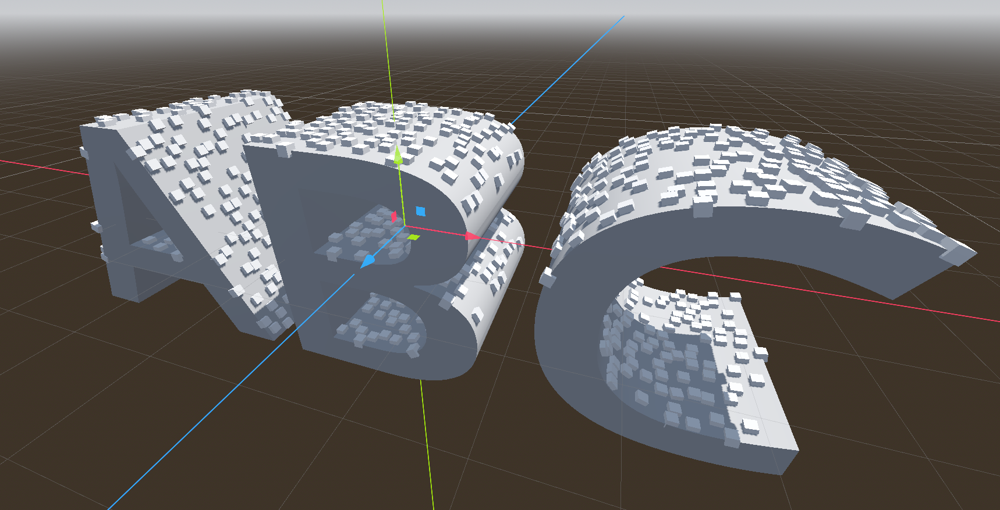
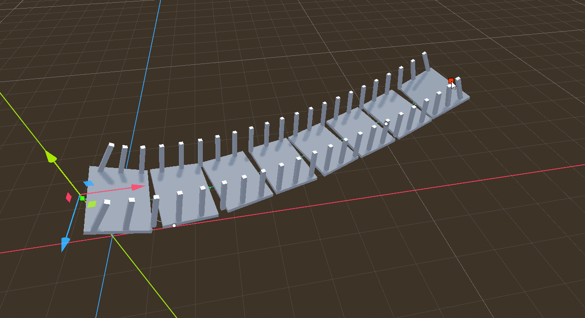

# Description

This is a Godot 4.4 plugin editor to have a similar tool to the Procedural Content Generator (PCG) from Unreal 5.X into Godot. I call the tool Flow Graph.

# Install

Copy the ```demo/addons/flow_nodes_editor``` and ```demo/bin``` folders into your project, then in the ```Project | Project Settings | Plugins``` enable the plugin "Flow Nodes Editor"

# Basic Usage

In a scene 3D:

* Create a new node of type FlowGraphNode3D
* Click on the 'Data Flow' panel that has appeared in the right panel of the Godot Editor.
* Press Shit+A or Right click to make the "Add Node..." popup appear.
* Select one node. For example ```Grid```
* Press 'D' to visualize in the 3D scenes the points as white boxes
* Tweak parameters of the selected node, like the number of elements in the grid node, or the Size
* Press 'E' to toggle the visualization in the Data Inspector panel and see the actual values of each point
    * Click on each row to highlight the point in the 3d scene as a magenta point

# Features

* +32 nodes including:
    - Sampling splines (contout and interior)
    - Sampling meshes
    - CSG operations with points sets
    - Spawn meshes/full scenes with customized parameters
    - Expressions evaluation
    - Partition / Reduce / Merge / Sort
    - Ray cast the scene to query and place points
    - Match and Set to assign custom assets to the points
    - Change point distribution using godot Curve editors
    - Scan nodes in your scene and gather metadata and attributes to feed the flow
* Grid Base Data Visualization 
* 3D Debug with colors
* Flow Graphs are godot resources with optional typed inputs
* Copy/Paste nodes into the clipboard as json documents

# Samples

Inside the ```demo``` folder there is a Godot 4.4 project. Inside the folder ```demos``` you can inspect some sample graphs.

### Sampling Top Faces of Mesh


### Procedural Basic Bridge


And the Associated graph

 

# Platforms
    
Precompiled versions of the plugin are provided for Windows and OSX platforms. But it should compile without problems in the Linux.

The tool is an editor tool, so it should work where the editor works. Most of the code is currently gdscript, except for wrappers classes to implement KDTrees (from https://github.com/jlblancoc/nanoflann) and RTrees (from https://github.com/nushoin/RTree)

# Roadmap

See the [file](demo/addons/flow_nodes_editor/README.md) 

# Build From Sources

    $ git submodule update --init
    $ scons
