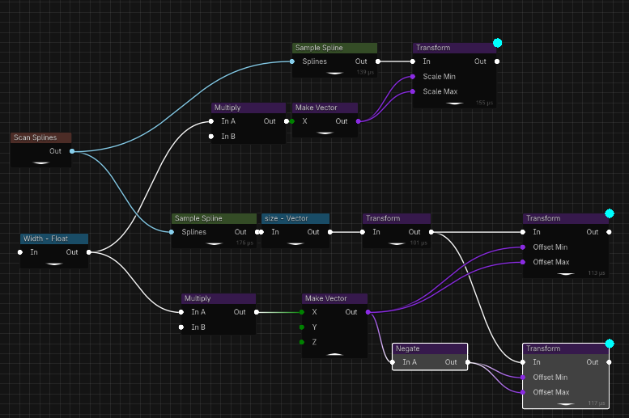

# Flow Graph (Flow Nodes Editor)

Procedural content graph for Godot 4.6 — an editor plugin inspired by Unreal Engine 5’s PCG. Build point sets, transform them, and spawn meshes/scenes through a visual flow graph.

## Description

Flow Graph is an editor-only tool that lets you assemble procedural pipelines using nodes. It focuses on point-set generation and transformation (sampling, CSG on points, partitioning, expressions, etc.), with live 3D debug and a Data Inspector to inspect results at each step.

Flow graphs are regular Godot resources and can expose typed inputs for reuse.

## Install

1. Copy the folders below into your project:
    * ```demo/addons/flow_nodes_editor``` 
    * ```demo/bin```
2. In Godot: **Project** → **Project Settings** → **Plugins** and enable "Flow Nodes Editor"

##  Quickstart

In a scene 3D:

* Add a node of type ```FlowGraphNode3D```
* Open the Data Flow dock (appears on the right when the plugin is enabled).
* Press **Shit+A** (or **Right click**) in the graph to open **Add Node….**
* Add a node, e.g. ```Grid```
* Press ```D``` to toggle the 3D debug on that node - points appear as white boxes in the viewport.
* Adjust the selected node’s parameters (e.g. grid count/size).
* Press ```E``` to toggle the **Data Inspector** and inspect the actual per-point values.
    * Click on each row to highlight the point in the 3d scene as a magenta point

## Handy Shortcuts

* **Shift+A** / **Right-click**: Add node
* **D**: Toggle 3D point debug
* **E**: Toggle Data Inspector
* **G**: Toggle Enable/Disable Node
* **C**: Create a comments box around selected nodes
* **X**: Deletes selected nodes
* **R**: Forces reevaluation of selected nodes

## Features

* **+30 nodes** including:
    - Sampling splines (contour and interior)
    - Sampling meshes
    - CSG-like ops on point sets (union/intersect/diff behavior)
    - Scene/mesh spawning with custom parameters
    - Expressions evaluation
    - Partition / Reduce / Merge / Sort
    - Ray casting into the scene to place/query points
    - Match and Set to assign custom assets to the points
    - Change point distribution using godot Curve editors
    - Scene scanning to gather metadata/attributes into the flow
* **Grid-based Data Inspector** with selection highlighting
* **3D Debug** overlays with color cues
* **Graphs as resource** with optional **typed inputs**
* **Copy/Paste nodes** into the clipboard as JSON

## Samples

A ready-to-run Godot 4.4 project is in demo folder. Explore graphs in demo/demos.

### Sampling Top Faces of Mesh


### Procedural Basic Bridge


And the Associated graph

 

## Platforms
    
Precompiled versions of the plugin are provided for Windows and OSX platforms. But it should compile without problems in the Linux.

The tool is an editor tool, so it should work where the editor works. Most of the code is currently gdscript, except for wrappers classes to implement KDTrees (from https://github.com/jlblancoc/nanoflann) and RTrees (from https://github.com/nushoin/RTree)

## Roadmap

See the [file](demo/addons/flow_nodes_editor/README.md) 

The plugin is functional, but I have not yet used in any serious project inside Godot. If you try to use it and find problems/suggestions please open an issue.

## Build From Sources

    $ git submodule update --init
    $ scons

