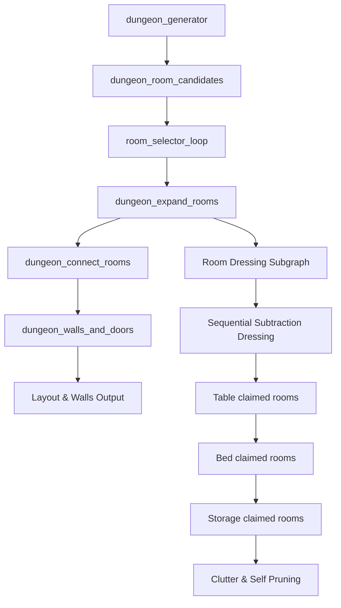

# PCGODOT (Flow Graph)

[](https://godotengine.org)
[](#)

**PCGODOT** is a highly powerful, node-based Procedural Content Generation (PCG) framework for Godot 4.6+, heavily inspired by **Unreal Engine 5's PCG**. It enables developers to construct intricate point-set distributions, manipulate spatial attributes, and spawn meshes, lights, or scene hierarchies procedurally using a visual flow graph editor inside Godot.

---

## 🎨 Gallery & Showcases

### 1. Sampling Meshes (Discarding Hard Edges)
Distribute points across the faces of a 3D Mesh while pruning points near hard edges.


### 2. Random Subscenes Distribution (Forests & Paths)
Distribute different subscenes randomly along curves and paths using attributes, custom rotation-alignment filters, and scene scanners.


### 3. Unified Filters & Category Popup
Browse nodes structured into standardized categories matching Unreal PCG. Select filters such as `Filter Data by Attribute`, `Filter Data by Tag`, and `Filter Data by Type`.


### 4. Proximity Sampling & Distance to Density
Sample points and scale their density values smoothly based on their distance/proximity to curves or splines.


### 5. Nested Subgraphs & Selection Collapse
Create nested graphs and easily collapse selected nodes into a reusable Subgraph.


### 6. Procedural Helical Colonnade & Rubble Scatter
Generate complex procedural architecture such as helical towers. Combines curve sampling with coordinate transforms, relative lintel placement, and duplicate scatter operations to create debris and rubble.


### 7. Fall Guys Hexagons
Generate dynamic gameplay platforms such as the multi-colored hexagon grid inspired by Fall Guys. Use the **Random Color** node to assign random color attributes from a palette to a MultiMesh.


---

## 🚀 Key Features

* **Unreal Engine PCG Alignment (1:1)**: Unified categories, names, and logic schemas conforming to the Unreal PCG specifications.
* **+110 Nodes**: A robust suite of nodes covering:
  * Spline, Mesh, Grid, and Volume sampling (surface, volume, interior).
  * Math operations, custom expressions, remapping, and reductions.
  * Tagging, attribute manipulation, and boolean data filters.
  * Spatial queries, raycasting, and Godot physics overlap queries.
  * Spawning of raw engine node classes (`OmniLight3D`, `VoxelGIProbe`, etc.) with point attribute mapping.
  * Random HSV or custom-palette color generation.
* **Interactive 3D Viewport Debugging**: Toggle 3D visualizations showing point positions, density gradients, scale, and rotations directly in Godot's editor.
* **Searchable Data Inspector**: Spreadsheet/table inspector showcasing attributes at any node, with active highlighting linked back to the 3D viewport.
* **Subgraphs & Loops**: Nest graphs with local parameters, custom outputs, and feedback loops.
* **Core Tagging Support**: A dedicated `tags` property (`PackedStringArray`) inside data elements for tag-based filtering.
* **Copy/Paste**: Import/export graph components instantly as JSON.
* **Auto-Reload Pipeline**: Automatically monitors filesystem changes, invalidates caches, and hot-reloads graphs in the editor.

---

## 🔍 Interactive Debugging & Analysis Modes

PCGODOT features interactive inspection utilities to debug procedural logic without compiling your game.

### 1. 3D Editor Debug View (Press `D`)
Select any node in the graph and press **`D`** (or toggle `debug_enabled` in the Inspector) to visualize generated points directly inside Godot's 3D viewport:
* **Debug Mode**: Toggle between `EXTENDS` (uses the point's actual bounds/scale) and `ABSOLUTE` (renders uniform debug cubes scaled by `debug_scale`).
* **Modulate Color**: Modulate debug colors dynamically by typing an attribute name (e.g. `density` or `color`) in the **Debug Modulate By** setting.
* **Debug Port Selector**: Pick which output port/data bulk to draw.

### 2. Searchable Data Inspector (Press `E`)
Press **`E`** (or select a node and click Inspect) to open the bottom **Data Inspector** spreadsheet:
* View a real-time, spreadsheet view of all point attributes (coordinates, rotations, scales, weights, and tags).
* **Attribute Filtering**: Search and filter points instantly using the filter bar (e.g., search for specific tags or range numbers).
* **Cross-Highlighting**: Click any row in the spreadsheet, and the matching point in the 3D viewport will highlight in Magenta and scale up, making it trivial to find which point matches which database row.

---

## 📂 Node Library Catalog

PCGODOT organizes nodes according to the official Unreal Engine PCG structure, expanded with custom Godot helpers.

### 🧩 Subgraphs & Control Flow
* **[subgraph.gd](file:///demo/addons/flow_nodes_editor/nodes/subgraph.gd)**: Runs another PCG graph resource inline with local parameter overrides.
* **[loop.gd](file:///demo/addons/flow_nodes_editor/nodes/loop.gd)**: Evaluates a subgraph repeatedly over elements (with feedback accumulators).
* **[input.gd](file:///demo/addons/flow_nodes_editor/nodes/input.gd)** / **[output.gd](file:///demo/addons/flow_nodes_editor/nodes/output.gd)**: Exposes input and output ports for subgraphs.
* **[branch.gd](file:///demo/addons/flow_nodes_editor/nodes/branch.gd)**: Directs point-sets down different paths based on conditions.
* **[select.gd](file:///demo/addons/flow_nodes_editor/nodes/select.gd)** / **[select_multi.gd](file:///demo/addons/flow_nodes_editor/nodes/select_multi.gd)**: Routes single or multiple datasets dynamically.
* **[switch.gd](file:///demo/addons/flow_nodes_editor/nodes/switch.gd)**: Evaluates multiple pathways using integer keys.

### 🏷️ Metadata & Attributes
* **[add_attribute.gd](file:///demo/addons/flow_nodes_editor/nodes/add_attribute.gd)** / **[remove_attribute.gd](file:///demo/addons/flow_nodes_editor/nodes/remove_attribute.gd)**: Dynamically appends or deletes attributes.
* **[attribute_rename.gd](file:///demo/addons/flow_nodes_editor/nodes/attribute_rename.gd)**: Renames custom point attributes.
* **[attribute_filter_range.gd](file:///demo/addons/flow_nodes_editor/nodes/attribute_filter_range.gd)** / **[point_filter_range.gd](file:///demo/addons/flow_nodes_editor/nodes/point_filter_range.gd)**: Filters points using values within numeric bounds.
* **[add_tags.gd](file:///demo/addons/flow_nodes_editor/nodes/add_tags.gd)** / **[delete_tags.gd](file:///demo/addons/flow_nodes_editor/nodes/delete_tags.gd)** / **[replace_tags.gd](file:///demo/addons/flow_nodes_editor/nodes/replace_tags.gd)**: Modifies string array tags on point-sets.
* **[tags_mutate.gd](file:///demo/addons/flow_nodes_editor/nodes/tags_mutate.gd)**: Mutates tags according to custom matching rules.
* **[mutate_seed.gd](file:///demo/addons/flow_nodes_editor/nodes/mutate_seed.gd)**: Permutes random seeds.
* **[point_to_attribute_set.gd](file:///demo/addons/flow_nodes_editor/nodes/point_to_attribute_set.gd)** / **[attribute_set_to_point.gd](file:///demo/addons/flow_nodes_editor/nodes/attribute_set_to_point.gd)**: Converts points to resource structures and back.
* **[load_data_table.gd](file:///demo/addons/flow_nodes_editor/nodes/load_data_table.gd)** / **[data_table_row_to_attribute_set.gd](file:///demo/addons/flow_nodes_editor/nodes/data_table_row_to_attribute_set.gd)**: Bridges external tables and spreadsheets into point properties.
* **[load_pcg_data_asset.gd](file:///demo/addons/flow_nodes_editor/nodes/load_pcg_data_asset.gd)**: Loads PCG point-sets saved as standalone resources.

### 📐 Math & Logic Ops
* **[math_op.gd](file:///demo/addons/flow_nodes_editor/nodes/math_op.gd)**: Performs basic math operations (+, -, *, /, Abs, etc.) between attributes or constants.
* **[remap.gd](file:///demo/addons/flow_nodes_editor/nodes/remap.gd)** / **[density_remap.gd](file:///demo/addons/flow_nodes_editor/nodes/density_remap.gd)**: Remaps attributes or density values across custom numeric ranges.
* **[expression.gd](file:///demo/addons/flow_nodes_editor/nodes/expression.gd)**: Evaluates complex custom mathematical expressions dynamically.
* **[reduce.gd](file:///demo/addons/flow_nodes_editor/nodes/reduce.gd)**: Aggregates values (Sum, Min, Max, Average) from point collections.
* **[boolean.gd](file:///demo/addons/flow_nodes_editor/nodes/boolean.gd)**: Performs logical and comparison tests on attributes.

### 📈 Splines & Paths
* **[create_spline.gd](file:///demo/addons/flow_nodes_editor/nodes/create_spline.gd)**: Forms a 3D spline curve connecting input points.
* **[sample_spline.gd](file:///demo/addons/flow_nodes_editor/nodes/sample_spline.gd)**: Samples points along a spline path, applying offset, normal alignment, or boundary spacing.
* **[split_splines.gd](file:///demo/addons/flow_nodes_editor/nodes/split_splines.gd)**: Cuts splines into segments.
* **[distance.gd](file:///demo/addons/flow_nodes_editor/nodes/distance.gd)** / **[distance_to_density.gd](file:///demo/addons/flow_nodes_editor/nodes/distance_to_density.gd)**: Calculates distances to curves, remapping density based on proximity.
* **[clip_points_by_polygon.gd](file:///demo/addons/flow_nodes_editor/nodes/clip_points_by_polygon.gd)** / **[clip_paths.gd](file:///demo/addons/flow_nodes_editor/nodes/clip_paths.gd)**: Discards points/paths sitting outside polygonal boundaries.
* **[create_surface_from_spline.gd](file:///demo/addons/flow_nodes_editor/nodes/create_surface_from_spline.gd)** / **[create_surface_from_polygon.gd](file:///demo/addons/flow_nodes_editor/nodes/create_surface_from_polygon.gd)**: Generates spatial meshes or bounding planes from splines or polygons.

### 📐 Point Transformations & Densities
* **[transform.gd](file:///demo/addons/flow_nodes_editor/nodes/transform.gd)**: Translates, rotates, and scales points.
* **[point_offsets.gd](file:///demo/addons/flow_nodes_editor/nodes/point_offsets.gd)**: Offsets point locations in local or global coordinate space.
* **[bounds_modifier.gd](file:///demo/addons/flow_nodes_editor/nodes/bounds_modifier.gd)**: Shrinks, expands, or aligns point bounds.
* **[build_rotation_from_up.gd](file:///demo/addons/flow_nodes_editor/nodes/build_rotation_from_up.gd)**: Computes rotation values to align assets to custom face normals or up vectors.
* **[snap_to_grid.gd](file:///demo/addons/flow_nodes_editor/nodes/snap_to_grid.gd)**: Aligns coordinates to grid spacing.
* **[self_pruning.gd](file:///demo/addons/flow_nodes_editor/nodes/self_pruning.gd)**: De-duplicates points by testing bounding box overlap.
* **[relax.gd](file:///demo/addons/flow_nodes_editor/nodes/relax.gd)**: Distributes point clusters evenly across surfaces.

### 📦 Assets & Spawning
* **[spawn_meshes.gd](file:///demo/addons/flow_nodes_editor/nodes/spawn_meshes.gd)**: Spawns Godot MultiMesh instances or MeshInstances onto points.
* **[spawn_scenes.gd](file:///demo/addons/flow_nodes_editor/nodes/spawn_scenes.gd)**: Spawns PackedScenes (`.tscn` / `.scn`) onto points.
* **[spawn_nodes.gd](file:///demo/addons/flow_nodes_editor/nodes/spawn_nodes.gd)**: Spawns raw nodes (`OmniLight3D`, `VoxelGIProbe`, etc.) mapping attributes to node properties.
* **[apply_on_actor.gd](file:///demo/addons/flow_nodes_editor/nodes/apply_on_actor.gd)**: Applies generated PCG structures directly to target actors/nodes.

### 🏰 Spatial & Physics Queries
* **[substract.gd](file:///demo/addons/flow_nodes_editor/nodes/substract.gd)**: Subtracts overlapping point-sets (A minus B).
* **[difference.gd](file:///demo/addons/flow_nodes_editor/nodes/difference.gd)** / **[intersection.gd](file:///demo/addons/flow_nodes_editor/nodes/intersection.gd)** / **[union.gd](file:///demo/addons/flow_nodes_editor/nodes/union.gd)**: Standard boolean set operations on point bounds.
* **[ray_cast.gd](file:///demo/addons/flow_nodes_editor/nodes/ray_cast.gd)**: Performs raycasts to ground points onto colliders or terrain.
* **[physics_overlap_query.gd](file:///demo/addons/flow_nodes_editor/nodes/physics_overlap_query.gd)** / **[physics_shape_sweep.gd](file:///demo/addons/flow_nodes_editor/nodes/physics_shape_sweep.gd)**: Sweeps shapes or queries physics bodies inside the viewport.
* **[navigation_region_sampler.gd](file:///demo/addons/flow_nodes_editor/nodes/navigation_region_sampler.gd)**: Restricts points to valid NavigationMeshes.

### 🧩 Generators & Dungeon Nodes
* **[grid.gd](file:///demo/addons/flow_nodes_editor/nodes/grid.gd)**: Generates a standard grid of points.
* **[grid_fill_bounds.gd](file:///demo/addons/flow_nodes_editor/nodes/grid_fill_bounds.gd)**: Fills coordinate bounds with grid patterns.
* **[grid_connect_points.gd](file:///demo/addons/flow_nodes_editor/nodes/grid_connect_points.gd)**: Connects grid coordinates using pathfinding algorithms.
* **[grid_boundary.gd](file:///demo/addons/flow_nodes_editor/nodes/grid_boundary.gd)**: Extracts outline boundary edges from grids.
* **[noise.gd](file:///demo/addons/flow_nodes_editor/nodes/noise.gd)**: Generates Perlin/Simplex noise modulations.
* **[dungeon_generator.gd](file:///demo/addons/flow_nodes_editor/nodes/dungeon_generator.gd)**: Auto-partitions spaces into rooms.
* **[dungeon_room_candidates.gd](file:///demo/addons/flow_nodes_editor/nodes/dungeon_room_candidates.gd)**: Spawns candidate room nodes.
* **[dungeon_connect_rooms.gd](file:///demo/addons/flow_nodes_editor/nodes/dungeon_connect_rooms.gd)**: Draws connecting corridor lines.
* **[dungeon_expand_rooms.gd](file:///demo/addons/flow_nodes_editor/nodes/dungeon_expand_rooms.gd)**: Resizes rooms dynamically.
* **[dungeon_walls_and_doors.gd](file:///demo/addons/flow_nodes_editor/nodes/dungeon_walls_and_doors.gd)**: Maps wall and doorway coordinates.

---

## 🏰 Case Study: Pure PCG Dungeon Pipeline (`demo_dungeon.tscn`)

The **Stress Test Dungeon** demo (`demo/demos/demo_dungeon.tscn`) is generated completely inside the visual PCG graph editor **without using any custom GDScript**. It showcases how complex dungeon layouts, asset dressing, and spatial constraints can be orchestrated purely through node connections.



### 1. Layout Generation
* **Dungeon bounds** (120×120 grid) are created via the `dungeon_generator`.
* Rooms are spawned through `dungeon_room_candidates` and overlapping rooms are pruned in the `room_selector_loop`.
* Corridors are drawn via `dungeon_connect_rooms`, and boundary edges are converted to walls and door anchors via `dungeon_walls_and_doors`.

### 2. Eliminating Floor Gaps
* Corridor pathways generated by `grid_connect_points` do not inherit a room style. To prevent empty gaps at junctions, the graph inserts an `add_attribute` node assigning a default `room_style=0` to all corridor cells, ensuring they render using the stone-tile mesh style.
* Bounding box modifiers align floor tiles precisely (`bounds` expanded from `0.515` to `0.52`) to ensure floor tiles overlap seamlessly.

### 3. Dedicated Corridor Doorways
* Instead of spawning doorways randomly along walls (causing doors to block empty corners), the graph isolates room boundary edges and corridor boundary edges and uses the **Subtract Intersection (A ∩ B)** node to find only the overlapping edges where a room meets a corridor.
* Doors are oriented facing outward using `build_rotation_from_up` mapped to the `boundary_normal` attribute and spawned exactly at thresholds.

### 4. Non-Stacking Dressing Pipeline
* To prevent furniture and props from stacking on top of each other, `subgraph_dungeon_dressing.tres` uses a sequential subtraction chain.
* Rooms claimed by the **Table dressing pipeline** subtract their bounds from the list. The remaining rooms are passed to the **Bed pipeline**, which claims rooms and subtracts their bounds, leaving the remainder for **Storage**, **Treasure**, and final **Clutter/Rubble scatter**.
* Every category runs a final `self_pruning` overlap check to verify that smaller props (plates, bottles, chests) sit neatly on top of tables and shelves rather than clipping through them.

---

## 🛠️ Setup & Installation

1. Copy the following folders from this repository into your Godot project's root:
   * `demo/addons/flow_nodes_editor`
   * `demo/bin`
2. Open your project in Godot: **Project** → **Project Settings** → **Plugins**.
3. Locate **Flow Nodes Editor** and toggle the status to **Enabled**.

---

## 🎮 Quickstart Guide

In a 3D Scene:
1. Create a `FlowGraphNode3D` node.
2. In the bottom dock panel, select the **Data Flow** workspace (appears when the node is selected).
3. Press **Shift+A** (or **Right-click**) inside the graph to open the **Add Node** search panel.
4. Add a generator like **Grid**, then connect it to **Spawn Scenes** or **Spawn Meshes**.
5. Press **D** on a selected node to toggle its 3D debug visualizer.
6. Press **E** to toggle the bottom **Data Inspector** spreadsheet.

---

## 🏗️ Building from Sources

If you want to compile the C++ wrappers (KdTree, RTree) yourself:

```bash
git submodule update --init
scons
```
Precompiled binaries for Windows and macOS are included under `demo/bin/` by default.

---

## 📄 License
This project is licensed under the MIT License. Feel free to adapt and expand it!
